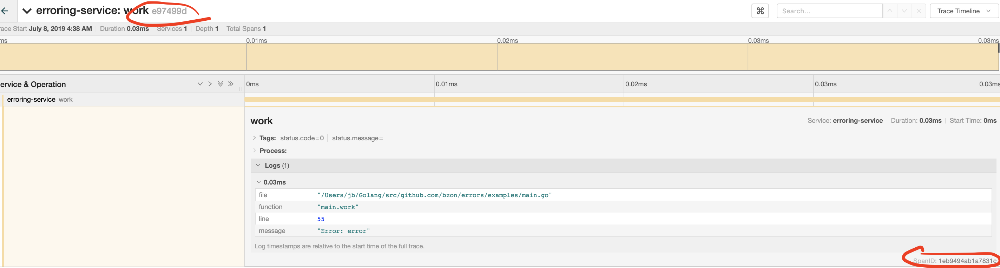

[](http://godoc.org/github.com/bzon/errors)

# errors

A drop-in replacement for creating errors with OpenCensus instrumentation (OpenTelemetry soon).

Initially, I created this package to help me link the details of my Stackdriver traces with Stackdriver logs.

* https://cloud.google.com/trace/docs/viewing-details
* https://cloud.google.com/logging/docs/reference/v2/rest/v2/LogEntry
* https://cloud.google.com/logging/docs/reference/v2/rest/v2/LogEntry#LogEntrySourceLocation

This package also supports the Go 1.13 `errors.As` and `errors.Is` methods. Please check the examples in Go doc.


## Getting Started

Drop-in replacement. Creating an error.

```golang
err := errors.New("msg") // Wrap .. Wrapf .. Errorf ..
```

Creating an error with context useful for monitoring.

```golang
func main() {
	_, span := trace.StartSpan(context.Background(), "main")
	defer span.End()

	err := errors.NewT(span, "error")
	fmt.Println(err)

	if erctx, ok := err.(errors.ErrorTracer); ok {
		fmt.Println(erctx.SourceLocation().Function)
		fmt.Println(erctx.SourceLocation().File)
		fmt.Println(erctx.SourceLocation().Line)
		fmt.Println(erctx.TraceContext().TraceID)
		fmt.Println(erctx.TraceContext().SpanID)
	}
}
```

Output

```txt
main.main
/Users/jb/Golang/src/github.com/bzon/errors/examples/main.go
15
d2d2b126d0474947821106525e32b6e0
1644b4b9be26c929
```

## Production Usage

See the source code of the example server in [examples](./examples) folder.

Useful for logging error with tracing context.

```console
$ go run main.go | jq '.'

{
  "caller": "main.go:38",
  "logging.googleapis.com/sourceLocation": {
    "function": "main.work",
    "file": "/Users/jb/Golang/src/github.com/bzon/errors/examples/main.go",
    "line": 55
  },
  "logging.googleapis.com/spanId": "1eb9494ab1a7831c",
  "logging.googleapis.com/trace": "e97499da53ef2a8fdf9681beddbe3d64",
  "message": "error",
  "ts": "2019-07-15T09:37:06.885078+02:00"
}
```

The annotations are automatically exported to any OpenCensus supported tracing platform. E.g. Jaeger.



